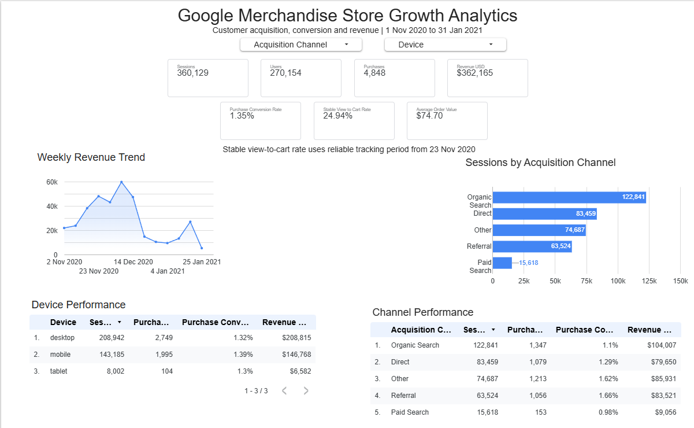
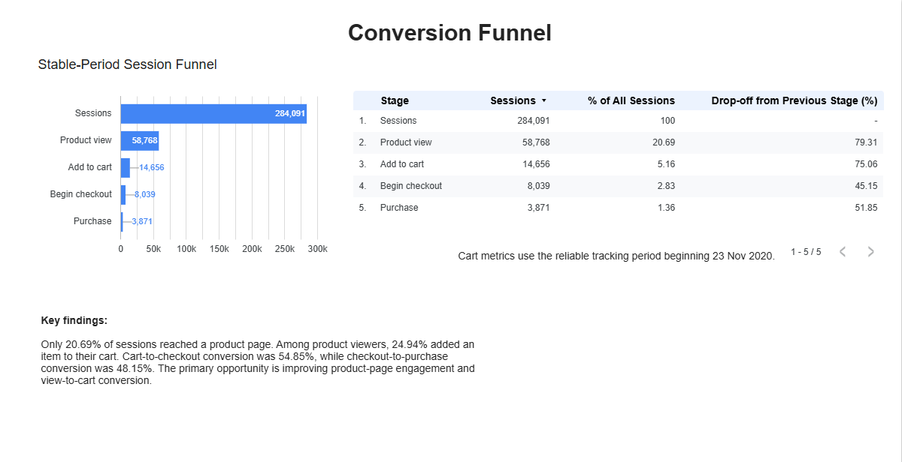
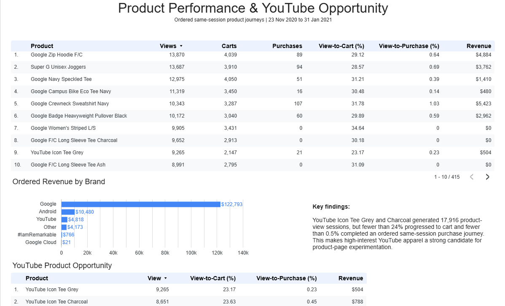
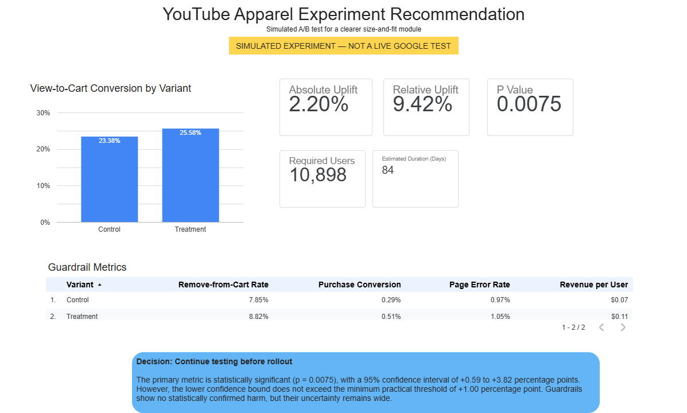

# Google Merchandise Store Growth Analytics

An end-to-end product analytics case study using the public Google Analytics 4 ecommerce sample. The project combines BigQuery SQL, Python experimentation and a four-page Looker Studio dashboard to identify customer-journey friction and propose a measurable growth experiment.

> The A/B-test observations are simulated for demonstration. They do not represent a live experiment conducted by Google.

## Business objective

The analysis answers four questions:

1. How is the store performing across devices and acquisition channels?
2. Where do customers leave the ecommerce funnel?
3. Which products and brands show high interest but weak purchase completion?
4. Can a clearer size-and-fit module improve YouTube apparel view-to-cart conversion without harming guardrail metrics?

## Executive findings

- The dataset contains **360,129 sessions**, **270,154 users**, **4,848 purchasing sessions** and **$362,165 in revenue**.
- During the reliable tracking period, only **20.69%** of sessions reached a product page.
- Among product viewers, **24.94%** added an item to their cart.
- YouTube Icon Tee Grey and Charcoal generated **17,916 ordered product-view sessions**, while fewer than 24% progressed to cart and fewer than 0.5% completed an ordered same-session purchase journey.
- In the simulated experiment, view-to-cart conversion increased from **23.38%** to **25.58%**.
- The estimated uplift was **2.20 percentage points** (95% CI: **+0.59 to +3.82 points**, p = **0.0075**).
- The result is statistically significant, but the lower confidence bound does not exceed the predefined practical threshold of one percentage point. The recommendation is therefore to **continue testing before rollout**.

## Dashboard

### Executive overview



### Conversion funnel



### Product performance



### Experiment recommendation



## Experiment design

| Element | Definition |
|---|---|
| Hypothesis | Clearer size and fit information will reduce uncertainty and increase basket additions |
| Control | Existing product page |
| Treatment | Size-and-fit component with measurements, fit descriptions, model measurements, stock availability and a clearer size-selection prompt |
| Randomisation unit | Anonymous user |
| Primary metric | Product view-to-cart conversion |
| Secondary metrics | Purchase conversion and revenue per user |
| Guardrails | Remove-from-cart rate and page-error rate |
| Significance level | 5% |
| Statistical power | 80% |
| Minimum detectable relative uplift | 10% |
| Minimum practical absolute uplift | 1 percentage point |

The power analysis requires **5,449 users per group**, or **10,898 users in total**. At the observed eligible traffic level, the estimated test duration is **84 days**.

## Methodology

1. Queried the public GA4 ecommerce export in BigQuery.
2. Constructed session-level funnel metrics and separated the reliable tracking period beginning 23 November 2020.
3. Built ordered same-session product journeys: product view, basket addition and purchase.
4. Classified merchandise into Google, Android, YouTube and other brands.
5. Selected high-interest YouTube apparel as the experimentation opportunity.
6. Calculated sample size from the historical user-level baseline.
7. Simulated reproducible control and treatment observations using fixed random seeds.
8. Evaluated the primary metric with a two-sided two-proportion z-test and unpooled confidence interval.
9. Assessed remove-from-cart, purchase, page-error and revenue guardrails.
10. Presented the results and decision in Looker Studio.

## Repository structure

```text
google-store-growth-analytics/
├── data/          # Simulated experiment outputs
├── images/        # Looker Studio dashboard pages
├── notebooks/     # Reproducible Python experiment
├── sql/           # 20 original analyses plus dashboard build scripts
├── .gitignore
├── README.md
└── requirements.txt
```

## Reproduce the Python analysis

```bash
python -m venv .venv
source .venv/bin/activate  # Windows: .venv\Scripts\activate
pip install -r requirements.txt
jupyter notebook notebooks/youtube_apparel_ab_test.ipynb
```

Run all cells from top to bottom. Fixed random seeds reproduce the reported simulated results and export the CSV files used in the dashboard.

## Data source

The project uses the `bigquery-public-data.ga4_obfuscated_sample_ecommerce` dataset. It contains anonymised and obfuscated Google Merchandise Store events. Revenue is reported in USD.

## SQL workflow

The `sql` directory preserves the complete numbered BigQuery analysis history:

- `01`–`05`: dataset, event, funnel, device and acquisition exploration
- `06`–`10`: product validation and increasingly strict product-funnel logic
- `11`–`16`: target-product, trend, metadata and brand comparisons
- `17`–`18`: user-level experiment and guardrail baselines
- `19`–`20`: session-funnel validation and dashboard-session modelling
- `21`–`22`: final product and simulated-experiment dashboard sources
- `23`: final data-quality checks

See [`sql/README.md`](sql/README.md) for the complete file-by-file index.

## Limitations

- The GA4 sample is historical and obfuscated.
- Tracking quality varies across the observation period, so funnel reporting uses a defined reliable period.
- Ordered same-session journeys are intentionally stricter than ordinary event totals.
- Brand classification partly relies on product-name rules where the source brand is missing.
- Experiment observations and guardrails are simulated from historical baselines.
- Rare purchase and revenue outcomes have wide uncertainty because the test is powered for view-to-cart conversion.
- Statistical significance does not by itself establish commercially meaningful impact.

## Tools

- **BigQuery SQL** for event transformation, funnel logic and product analysis
- **Python** with pandas, NumPy, SciPy, statsmodels and Matplotlib
- **Looker Studio** for interactive reporting and decision communication

## Author

**Miroslaw Mus**  
[Portfolio](https://mireqq.vercel.app) · [GitHub](https://github.com/Mireqq) · [LinkedIn](https://www.linkedin.com/in/miroslaw-mus)
